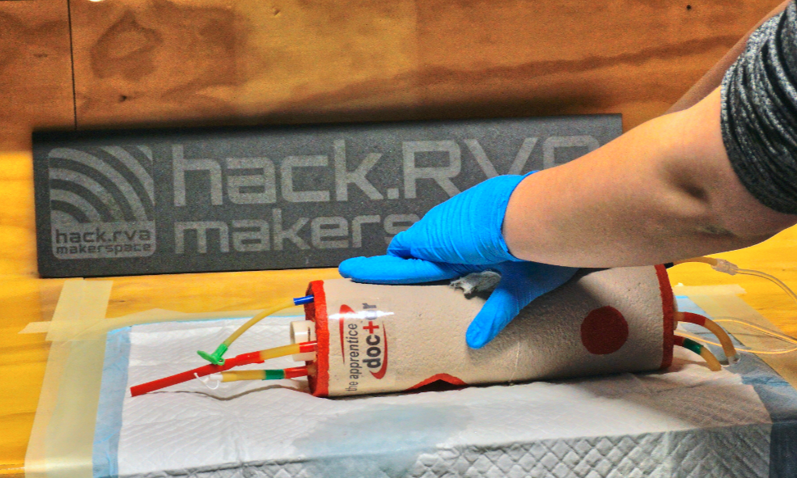

Last Saturday, we had a class on treatment of serious, traumatic bleeding. It was taught by a certified instructor, and now a member is certified to teach the class in the future. We have never had a serious injury at hack.RVA, but we like to try to be safe. We have first aid kits in every room, some including special clotting material. We have fire extinguishers in almost every room, although we might need to have a class or two on their use. We have training for members on the safe use of all of our equipment, but we know people sometimes forget or ignore safety. We ask members to watch out for each other, and say something before something bad happens.
